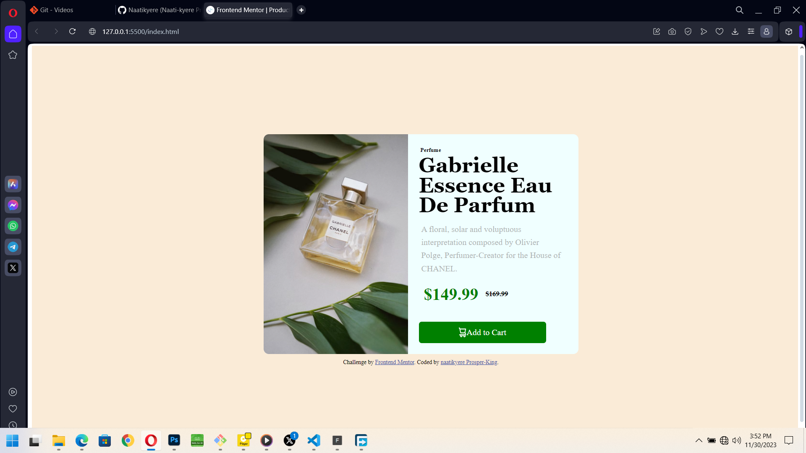

# Frontend Mentor - Product preview card component solution

This is a solution to the [Product preview card component challenge on Frontend Mentor](https://www.frontendmentor.io/challenges/product-preview-card-component-GO7UmttRfa). Frontend Mentor challenges help you improve your coding skills by building realistic projects. 

## Overview

### The challenge

Users should be able to:

- View the optimal layout depending on their device's screen size
- See hover and focus states for interactive elements

### Screenshot




### Links

- Solution URL: [Add solution URL here](https://github.com/Naatikyere/Product-preview-card.git)
- Live Site URL: [Add live site URL here](https://your-live-site-url.com)

## My process

### Built with

- Semantic HTML5 markup
- CSS custom properties
- Flexbox
- Desktop-first workflow


```css
 .img_info p{
      white-space: initial;
      line-height: 25px;   
    }

```


### Continued development

Looks like the use of Basic HTML and CSS understanding is better now. And i would like to focus more on Javascript.

Would be working on Javascript related assignments in the near future. Would Love to have More mentors to help and guide me in my choosen field.

And would work using frame works like react also. 


## Author

- Website - [Naati-kyere Dome Prosper](https://www.your-site.com)
- Frontend Mentor - [@prosperKing](https://www.frontendmentor.io/profile/prosperking)
- Twitter - [@prosperking7](https://www.twitter.com/prosperking7)


## Acknowledgments

My whole jouney on how good I become with web development is because of my mentor @casprine who guided me to understand all the basic i know today. And also my williness to become very good at frontend Engineering. 

